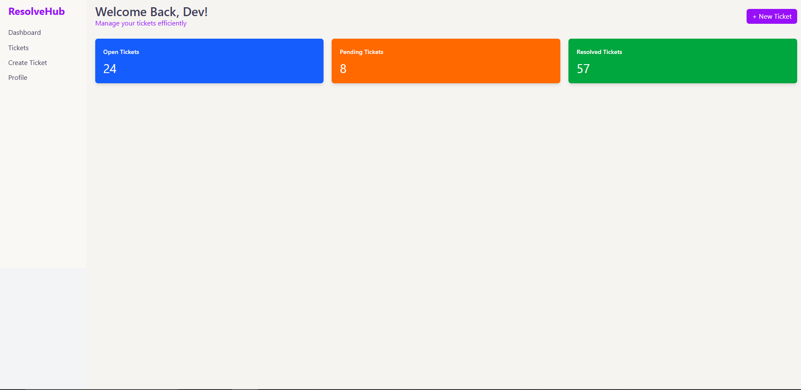

# 🛠️ Resolve Hub - Customer Support & Ticketing System

Resolve Hub is a full-stack web application designed to simplify and manage customer support workflows. It provides a clean and intuitive interface for both users and admins to handle support tickets efficiently.

## 🚀 Features

### 👤 User Side
- Register and login with JWT-based authentication
- Create, view, edit, and delete support tickets
- Chat with admin for support
- Responsive dashboard with ticket status tracking

### 🛡️ Admin Side
- View and manage all user tickets
- Change ticket statuses (open, in-progress, resolved)
- Assign tickets to agents
- Prioritize and delete tickets
- Manage registered users and reply to user messages

## 🧰 Tech Stack

**Frontend:**
- React.js
- Tailwind CSS
- Vite

**Backend:**
- Node.js
- Express.js
- MongoDB (MongoDB Atlas)
- Mongoose
- JWT (Authentication)

**Tools:**
- Git & GitHub
- Postman (API Testing)
- VS Code

## 📂 Folder Structure

ResolveHub/
├── backend/
│ ├── controllers/
│ ├── models/
│ ├── routes/
│ ├── config/
│ ├── server.js
├── frontend/
│ ├── src/
│ ├── components/
│ ├── pages/
│ ├── App.jsx
├── .env
├── .gitignore
├── README.md

## 📸 Screenshots

### 🧑‍💻 User Dashboard


### 🔐 Login Page
.png)

### 📝 Signup Page
.png)

### 🎫 Ticket List
.png)

### 🧾 Ticket Detail View
.png)

### 🛠️ Admin Dashboard
.png)

### 👤 User Profile Page
.png)

### 💬 Chat/Contact Page
.png)


## Setup Instructions

### 1. Clone the Repository

```bash
git clone https://github.com/1devchoudhary/ResolveHub.git
cd ResolveHub

## Backend Setup
cd backend
npm install

PORT=5000
MONGO_URI=your_mongodb_connection_string
JWT_SECRET=your_jwt_secret

npm start

## Frontend Setup

cd ../frontend
npm install
npm run dev
